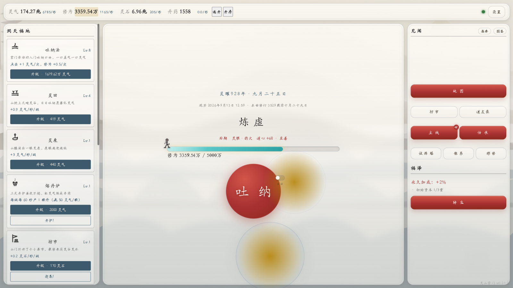
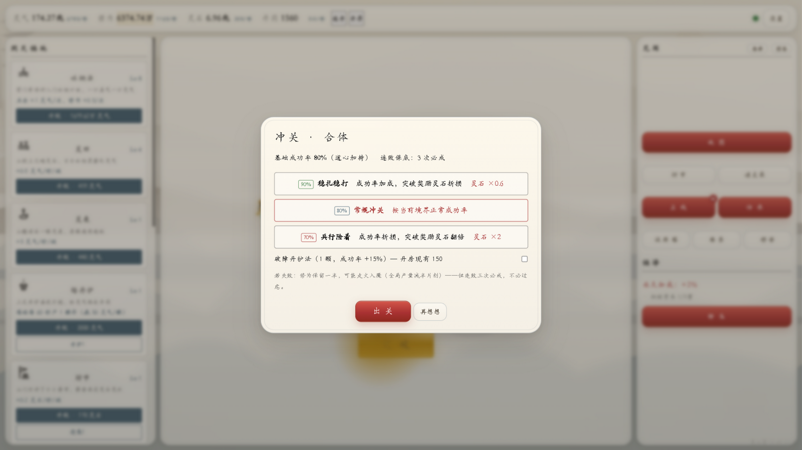
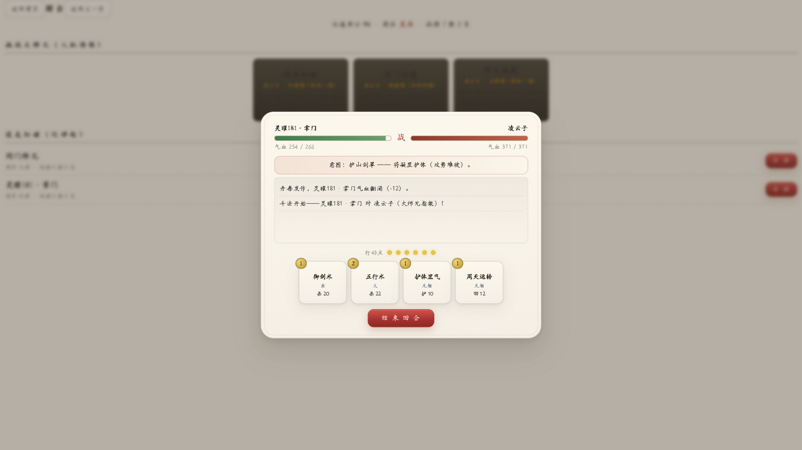
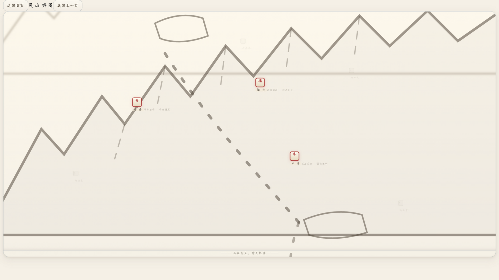

# 灵山掌门 · Spirit Mountain Sect Master

水墨风修仙放置挂机网页游戏，附带基于大模型的「动态奇遇」系统。纯前端实现，零第三方依赖，全程免费可玩。

- **零依赖**：无框架、无构建、无 CDN——单文件夹即整个游戏
- **免费无内购**：进度本地存档，不注册、不登录、无广告、无付费通道
- **可选 AI 奇遇**：接入大模型后，奇遇由 LLM 即时生成；不接入也有 60+ 条内置事件池

## 特性

- **吐纳修行**：点按吐纳攒灵气修为，支持长按连点与自动吐纳
- **突破渡劫**：三档冲关策略 + 破障丹护法，金丹起天雷轰顶，失败可能走火入魔，连败三次必成
- **十二洞天福地**：随境界逐步解锁的建筑线，离线收益照常结算
- **奇遇五选一**：触发时摊开五桩候选由你挑一件经历（事件卡本身仍是「其一/其二/离去」两条路）；离线归来也从池里五选一；接入 LLM 后可生成从未见过的动态奇遇
- **坊市与丹房**：买兵器功法、开炉炼丹，劣品丹便宜但伤身——丹毒机制贯穿全局
- **回合制斗法**：出战的是你在招式录里自配的 8 槽卡组（手牌每回合整套在手，只按行动点决定能使哪几张）、每回合只出一招——出招消耗行动点（= 境界+1），点用光了要「调息」回满；看对方意图决定攻守，五行克制、罡气护罩、秘传牌针对
- **招式录**：攻式 3 · 五行 2 · 守式 2 · 回式 1 的卡组编成（买了秘传才有牌可带，策略性从这儿来），论道积分升段位（凡品→灵品→珍品→仙品）
- **市集**：息壤/聚灵符/悟道茶 + 秘传残页/淬锋石/破障符/护心镜——灵石长线换战力，价格随产业水涨船高
- **留言板**：设置页可直接给作者递建议（本地代理落盘 data/feedback.jsonl；没开代理先存本机，下次自动补交）
- **道友录**：名片码加好友，与朋友跨存档切磋、在线约战
- **灵山舆图**：手绘 SVG 山径，丹房、擂台、市场散布山间
- **转生传承**：化神后兵解转世，传承点换永久加成；图鉴六页跨转生保留

## 在线试玩与本地运行

**在线试玩**（完整模式，含 LLM 动态奇遇）：<http://106.55.46.23:8090>

**GitHub Pages 镜像**（纯单机模式）：**开放至 2026-09-27 截止，到期下线。**
<https://1695118163.github.io/Spirit-Mountain-Sect-Master/>

> 纯单机模式：除「LLM 动态奇遇」外全部玩法可用。

**本地运行（两种方式）：**

1. **完整模式**（含 LLM 动态奇遇）：安装 [Node.js](https://nodejs.org/) 18+ 后双击 `start.bat`，浏览器访问 <http://127.0.0.1:8787>（本地代理窗口保持开启）。
2. **纯单机模式**：直接双击 `index.html` 即可游玩，无需任何安装。

存档保存在浏览器 localStorage，支持游戏内一键导出/导入文本迁移。

### 版本发布

- 游戏版本只取 `main` 分支可达的最高 `v主版本.次版本.修订号` Tag；开发分支不单独生成版本号。
- 推送新 Tag 后，GitHub Actions 会自动写入版本号并生成 `Spirit-Mountain-Sect-Master-vX.Y.Z.zip` 正式发布包。
- 正式下载请使用 Release 附件中的上述 ZIP。GitHub 自动附带的 `Source code` 压缩包不会执行版本写入流程。
- 本地需要手动同步时运行 `node tools/sync-version.js`，脚本同样只读取 `main` 的最新 Tag。

## 截图

| | |
|---|---|
|  |  |
|  |  |

## 技术栈

- 原生 JavaScript / CSS / 内联 SVG / Web Audio API（音效程序合成，无音频文件）
- Node.js 本地代理（`server.js`）：静态托管 + LLM API 转发，密钥只在本地 `config.json`
- 大模型动态奇遇：[火山方舟](https://www.volcengine.com/product/ark) OpenAI 兼容接口，用户自备 API Key（有免费额度），`config.example.json` 为配置模板
- 数值全部外置于 `data/balance.json`，事件池外置于 `data/events.json`，改数值无需动代码

## 开发历程

**原型期（M1–M5，2026-08-29 单日完成）**：从空文件夹到可玩闭环——核心引擎与全局状态 → 十二建筑与离线收益 → 61 条内置事件池与效果管线 → LLM 动态奇遇链路 → 水墨美术与转生系统。每个里程碑以 `node balance_check.js` 数值模拟门禁验收。

**功能成型期（M6–M26）**：玩法纵深铺开——丹药体系与丹毒机制、好友名片与回合制斗法、五行克制与秘传牌、在线约战房间、手绘灵山舆图、主线任务链、试炼塔与图鉴收集。数值经过双画像模拟压测。

**打磨期（v0.18 起）**：体验与性能双线打磨——五层景深视觉重做与突破爆发特效、hash 真路由（手机返回手势可用）、点击穿透与滚动误触修复、自动吐纳节流优化（此前每秒 ~27 次 DOM 操作导致掉帧）、主线任务 v2（欠账补领制，一次性奖励永不丢失）。

完整提交历史保留在 git log 中，30 个版本 tag 与里程碑一一对应。

## 开源协议

[MIT License](LICENSE)

## 关于 AI 协助开发

本项目由人类作者主导玩法设计、数值取向、体验验收与发布决策；大模型（GLM 等）深度参与了编码实现、美术方案起草与数值方案建议。游戏内的「LLM 动态奇遇」同样基于大模型生成文案——这既是功能，也是开发方式的延伸。

## 致谢

- [火山方舟](https://www.volcengine.com/product/ark) —— LLM 推理与免费推理额度
- 所有试玩反馈的朋友
